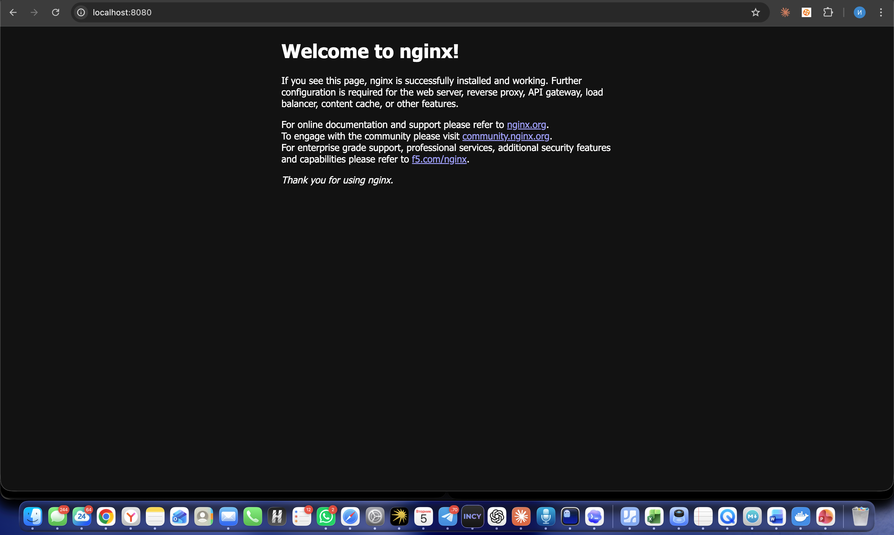
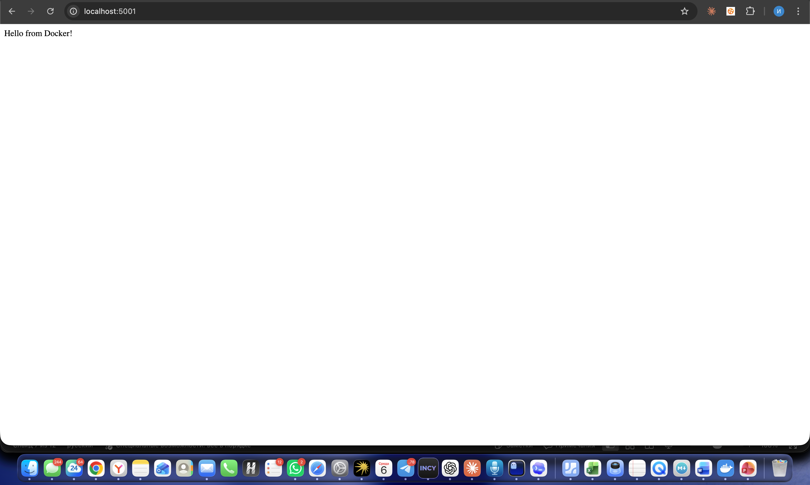

University: [ITMO University](https://itmo.ru/ru/)
Faculty: [FICT](https://fict.itmo.ru)
Course: [Введение в веб технологии](https://itmo-ict-faculty.github.io/introduction-in-web-tech/)
Year: 2025/2026
Group: U4255
Author: Yangalin Islam Azamatovich
Lab: Lab1
Date of create: 05.05.2026
Date of finished: 06.05.2026

---

# Лабораторная работа №1 — Основы работы с Docker

## Цель
Научиться устанавливать Docker, запускать готовые образы, управлять контейнерами и томами, а также собирать собственный образ по Dockerfile.

## Окружение
- macOS (Apple Silicon, arm64).
- Docker Desktop, Docker CLI 29.4.1.
- Терминал zsh.

---

## 1. Установка Docker и проверка работоспособности

```bash
docker --version
```

Вывод:
```
Docker version 29.4.1, build 055a478
```

```bash
docker info | head -20
```

Вывод (фрагмент):
```
Client:
 Version:    29.4.1
 Context:    desktop-linux
 Debug Mode: false
 Plugins:
  agent: Docker AI Agent Runner (Docker Inc.)
    Version:  v1.44.0
    ...
  buildx: Docker Buildx (Docker Inc.)
    Version:  v0.33.0-desktop.1
  compose: Docker Compose (Docker Inc.)
    Version:  v5.1.3
```

Запуск тестового контейнера:

```bash
docker run --rm hello-world
```

Вывод:
```
Hello from Docker!
This message shows that your installation appears to be working correctly.

To generate this message, Docker took the following steps:
 1. The Docker client contacted the Docker daemon.
 2. The Docker daemon pulled the "hello-world" image from the Docker Hub.
    (arm64v8)
 3. The Docker daemon created a new container from that image which runs the
    executable that produces the output you are currently reading.
 4. The Docker daemon streamed that output to the Docker client, which sent it
    to your terminal.
```

Базовые команды Docker:

```bash
docker images
docker ps
docker ps -a
```

Вывод:
```
IMAGE                ID             DISK USAGE   CONTENT SIZE   EXTRA
hello-world:latest   f9078146db2e       22.6kB         10.3kB

CONTAINER ID   IMAGE     COMMAND   CREATED   STATUS    PORTS     NAMES

CONTAINER ID   IMAGE     COMMAND   CREATED   STATUS    PORTS     NAMES
```

Полные логи: [`logs/01-version.txt`](logs/01-version.txt), [`logs/02-info.txt`](logs/02-info.txt), [`logs/03-hello-world.txt`](logs/03-hello-world.txt), [`logs/04-images.txt`](logs/04-images.txt).

---

## 2. Работа с готовыми образами Ubuntu

```bash
docker pull ubuntu:latest
```

Вывод:
```
latest: Pulling from library/ubuntu
4a7720058461: Pull complete
2113f8d7eb32: Pull complete
Digest: sha256:f3d28607ddd78734bb7f71f117f3c6706c666b8b76cbff7c9ff6e5718d46ff64
Status: Downloaded newer image for ubuntu:latest
docker.io/library/ubuntu:latest
```

Спецификация требует интерактивную сессию `docker run -it ubuntu bash` с последующей установкой `curl`. Я выполнил эквивалент одной командой через `bash -c`, чтобы зафиксировать вывод полностью:

```bash
docker run --rm ubuntu bash -c "apt update && apt install -y curl && curl --version"
```

Хвост вывода:
```
Setting up curl (8.18.0-1ubuntu2.1) ...
Processing triggers for libc-bin (2.43-2ubuntu2) ...
curl 8.18.0 (aarch64-unknown-linux-gnu) libcurl/8.18.0 OpenSSL/3.5.5 zlib/1.3.1 brotli/1.2.0 zstd/1.5.7 libidn2/2.3.8 libpsl/0.21.2 libssh2/1.11.1 nghttp2/1.68.0 librtmp/2.3 mit-krb5/1.22.1 OpenLDAP/2.6.10
Release-Date: 2026-01-07, security patched: 8.18.0-1ubuntu2.1
Protocols: dict file ftp ftps gopher gophers http https imap imaps ipfs ipns ldap ldaps mqtt pop3 pop3s rtmp rtsp scp sftp smb smbs smtp smtps telnet tftp ws wss
Features: alt-svc AsynchDNS brotli GSS-API HSTS HTTP2 HTTPS-proxy IDN IPv6 Kerberos Largefile libz NTLM PSL SPNEGO SSL threadsafe TLS-SRP UnixSockets zstd
```

Полный лог: [`logs/08-ubuntu-curl.txt`](logs/08-ubuntu-curl.txt).

`exit` в спецификации не понадобился — флаг `--rm` сам удалил контейнер после завершения команды.

---

## 3. Запуск веб-сервера nginx

```bash
docker run -d -p 8080:80 --name web-server nginx:alpine
```

Вывод:
```
Unable to find image 'nginx:alpine' locally
alpine: Pulling from library/nginx
...
Status: Downloaded newer image for nginx:alpine
c5cff3cf7ad694f3e7191f98f7e3f45c6292d13be8beca3c7554728e3ec77974
```

Проверка через curl:

```bash
curl -s http://localhost:8080 | head -5
```

Вывод:
```
<!DOCTYPE html>
<html>
<head>
<title>Welcome to nginx!</title>
<style>
```

Стартовая страница nginx в браузере:



Логи контейнера:

```bash
docker logs web-server
```

Фрагмент:
```
2026/05/05 20:44:00 [notice] 1#1: nginx/1.29.8
2026/05/05 20:44:00 [notice] 1#1: built by gcc 15.2.0 (Alpine 15.2.0)
2026/05/05 20:44:00 [notice] 1#1: OS: Linux 6.12.76-linuxkit
2026/05/05 20:44:00 [notice] 1#1: start worker processes
192.168.65.1 - - [05/May/2026:20:44:02 +0000] "GET / HTTP/1.1" 200 896 "-" "curl/8.7.1" "-"
192.168.65.1 - - [05/May/2026:20:44:16 +0000] "GET / HTTP/1.1" 200 896 "-" "Mozilla/5.0 ... Chrome/147.0.0.0 Safari/537.36" "-"
```

Полные логи: [`logs/10-nginx-logs.txt`](logs/10-nginx-logs.txt).

Вместо интерактивного `docker exec -it web-server sh` я выполнил неинтерактивный `docker exec`, чтобы сохранить вывод:

```bash
docker exec web-server cat /etc/nginx/nginx.conf | head -30
```

Вывод (начало `nginx.conf`):
```
user  nginx;
worker_processes  auto;

error_log  /var/log/nginx/error.log notice;
pid        /run/nginx.pid;

events {
    worker_connections  1024;
}

http {
    include       /etc/nginx/mime.types;
    default_type  application/octet-stream;
    ...
}
```

Полный лог: [`logs/11-nginx-conf.txt`](logs/11-nginx-conf.txt).

---

## 4. Управление контейнерами

```bash
docker ps
```

Вывод:
```
CONTAINER ID   IMAGE          COMMAND                  CREATED              STATUS              PORTS                                     NAMES
c5cff3cf7ad6   nginx:alpine   "/docker-entrypoint.…"   About a minute ago   Up About a minute   0.0.0.0:8080->80/tcp, [::]:8080->80/tcp   web-server
```

```bash
docker stop web-server
docker ps -a
```

Вывод:
```
web-server
CONTAINER ID   IMAGE          COMMAND                  CREATED              STATUS                              PORTS     NAMES
c5cff3cf7ad6   nginx:alpine   "/docker-entrypoint.…"   About a minute ago   Exited (0) Less than a second ago             web-server
```

Запуск остановленного контейнера:

```bash
docker start web-server
```

Вывод:
```
web-server
```

Удаление контейнера и образа:

```bash
docker stop web-server
docker rm web-server
docker rmi nginx:alpine
```

Вывод:
```
web-server
web-server
Untagged: nginx:alpine
Deleted: sha256:5616878291a2eed594aee8db4dade5878cf7edcb475e59193904b198d9b830de
```

Полный лог: [`logs/12-mgmt.txt`](logs/12-mgmt.txt).

---

## 5. Работа с томами (volumes)

```bash
docker volume create my-volume
```

Вывод:
```
my-volume
```

Запуск первого контейнера с подключённым томом, запись файла:

```bash
docker run -d --name volume-test -v my-volume:/data ubuntu sleep 3600
docker exec volume-test bash -c 'echo "Hello from volume" > /data/test.txt && ls /data && cat /data/test.txt'
```

Вывод:
```
d8a5229305dc12d99b1aaec82bfbe9d40a21bf1011fb6cfbf2c28cbe11071d35
test.txt
Hello from volume
```

Удаляем первый контейнер, создаём второй с тем же томом и проверяем содержимое файла:

```bash
docker rm -f volume-test
docker run -d --name volume-test2 -v my-volume:/data ubuntu sleep 3600
docker exec volume-test2 cat /data/test.txt
```

Вывод:
```
volume-test
aec40ea708a4860a4e46c0f036c331f2331e225d7931058a7ec84b89d2d5f63b
Hello from volume
```

Файл сохранился в томе, несмотря на удаление и пересоздание контейнера — именно это и должны демонстрировать тома.

Cleanup:

```bash
docker rm -f volume-test2
docker volume rm my-volume
```

Полный лог: [`logs/13-volumes.txt`](logs/13-volumes.txt).

---

## Лабораторная со звёздочкой — Dockerfile под Flask

### Файлы проекта

`app.py`:

```python
from flask import Flask
app = Flask(__name__)

@app.route('/')
def hello():
    return "Hello from Docker!"

if __name__ == '__main__':
    app.run(host='0.0.0.0', port=5000)
```

`requirements.txt`:

```
Flask==2.0.1
Werkzeug==2.0.3
```

> Werkzeug 2.0.3 закреплён, чтобы Flask 2.0.1 не сломался на Werkzeug ≥2.1, где исчез `werkzeug.urls.url_quote`.

### Dockerfile

```dockerfile
# Use Python 3.9 slim as base image
FROM python:3.9-slim

# Set working directory
WORKDIR /app

# Install system packages
RUN apt-get update && apt-get install -y \
    curl \
    vim \
    && rm -rf /var/lib/apt/lists/*

# Copy requirements.txt and install Python packages
COPY requirements.txt .
RUN pip install --no-cache-dir -r requirements.txt

# Copy application file
COPY app.py .

# Create user with UID 1000
RUN useradd -m -u 1000 appuser

# Switch to appuser
USER appuser

# Expose port 5000
EXPOSE 5000

# Set environment variable
ENV FLASK_ENV=production

# Run the application
CMD ["python", "app.py"]
```

Соответствие требованиям спецификации:

| № | Требование | Где реализовано |
|---|------------|-----------------|
| 1 | База `python:3.9-slim` | `FROM python:3.9-slim` |
| 2 | `WORKDIR /app` | `WORKDIR /app` |
| 3 | Установка `curl` и `vim` | `apt-get install -y curl vim` |
| 4 | Установка Python-пакетов из `requirements.txt` | `pip install --no-cache-dir -r requirements.txt` |
| 5 | Копирование `app.py` | `COPY app.py .` |
| 6 | Пользователь `appuser` с UID 1000 | `useradd -m -u 1000 appuser` |
| 7 | Переключение на `appuser` | `USER appuser` |
| 8 | Открытие порта 5000 | `EXPOSE 5000` |
| 9 | `FLASK_ENV=production` | `ENV FLASK_ENV=production` |
| 10 | Запуск `python app.py` | `CMD ["python", "app.py"]` |

### Сборка образа

```bash
docker build -t my-flask-app .
```

Хвост вывода (полный — в [`logs/14-flask-build.txt`](logs/14-flask-build.txt)):

```
#10 3.873 Successfully installed Flask-2.0.1 Jinja2-3.1.6 MarkupSafe-3.0.3 Werkzeug-2.0.3 click-8.1.8 itsdangerous-2.2.0
...
#11 [6/7] COPY app.py .
#11 DONE 0.0s

#12 [7/7] RUN useradd -m -u 1000 appuser
#12 DONE 0.1s

#13 exporting to image
#13 naming to docker.io/library/my-flask-app:latest done
#13 unpacking to docker.io/library/my-flask-app:latest
#13 DONE 1.6s
```

### Запуск контейнера

> macOS занимает порт 5000 системным AirPlay Receiver, поэтому пробросил локальный порт 5001 на контейнерный 5000. Команда из спецификации (`-p 5000:5000`) на чистой системе работает без правок.

```bash
docker run -d -p 5001:5000 --name flask-container my-flask-app
curl http://localhost:5001
```

Вывод:
```
15242bf7fa7079ff90486001f722333d34c2c5a98fb520727fe34ce5cebc57d3
Hello from Docker!
```

Логи контейнера:

```bash
docker logs flask-container
```

Вывод:
```
 * Serving Flask app 'app' (lazy loading)
 * Environment: production
   WARNING: This is a development server. Do not use it in a production deployment.
 * Debug mode: off
 * Running on all addresses.
 * Running on http://172.17.0.2:5000/ (Press CTRL+C to quit)
151.101.0.223 - - [05/May/2026 20:46:42] "GET / HTTP/1.1" 200 -
```

Страница приложения в браузере:



Полный лог: [`logs/15-flask-run.txt`](logs/15-flask-run.txt).

---

## Результаты

- Установлен и проверен Docker 29.4.1.
- Освоен полный жизненный цикл контейнера: `pull`, `run`, `ps`, `stop`, `start`, `rm`, `rmi`.
- Развёрнут nginx, проверены логи и конфиг через `docker exec`.
- Подтверждена персистентность данных в томе между двумя разными контейнерами.
- По спецификации собран собственный Dockerfile для Flask-приложения, образ `my-flask-app` запущен и отвечает `Hello from Docker!`.

## Выводы

Docker даёт быстро и воспроизводимо развернуть как готовый сервис (nginx за одну команду), так и собственное приложение (Flask по Dockerfile). Тома отделяют состояние от контейнера — это ключевое отличие от «сделать всё в самом контейнере, а потом потерять данные при `docker rm`». При защите главное — понимать порядок инструкций в Dockerfile (системные пакеты → зависимости → код → пользователь → CMD), потому что именно этот порядок влияет на размер образа и на эффективность кеша слоёв.
