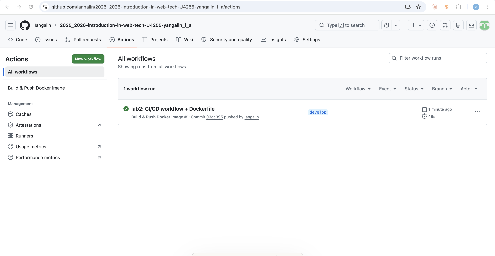
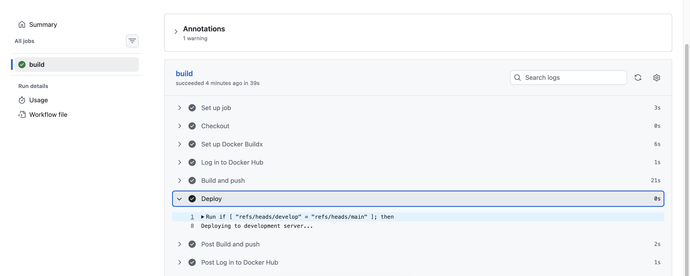
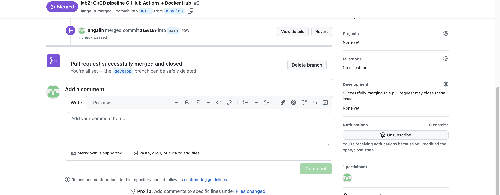
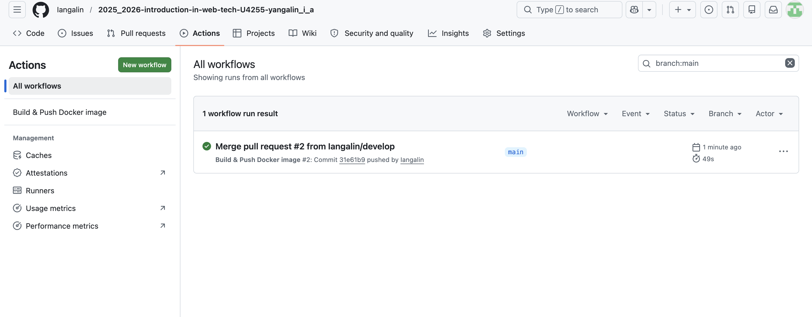
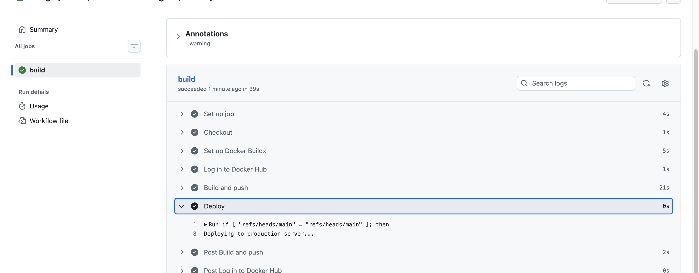
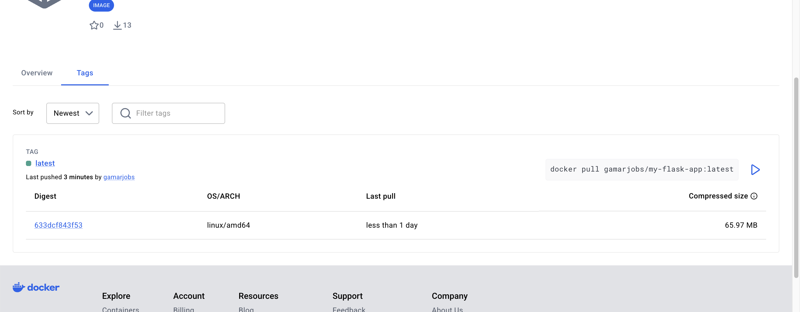

University: [ITMO University](https://itmo.ru/ru/)
Faculty: [FICT](https://fict.itmo.ru)
Course: [Введение в веб технологии](https://itmo-ict-faculty.github.io/introduction-in-web-tech/)
Year: 2025/2026
Group: U4255
Author: Yangalin Islam Azamatovich
Lab: Lab2
Date of create: 06.05.2026
Date of finished: 06.05.2026

---

# Лабораторная работа №2 — CI/CD для Docker-приложения

## Цель

Настроить автоматический пайплайн на GitHub Actions, который при push в ветки `main` и `develop` собирает Docker-образ Flask-приложения из lab1 и публикует его в Docker Hub. Дополнительная часть («со звёздочкой») — условный шаг деплоя, отличающий production-ветку от development-ветки.

## Архитектурное решение

Workflow расположен в корневой директории репозитория `.github/workflows/docker-build.yml` (GitHub Actions подхватывает только корневой `.github/workflows/`, файлы внутри подпапок типа `lab2/.github/` игнорируются). Build context для `docker/build-push-action` указан как `./lab1` — это позволяет переиспользовать `Dockerfile`, `app.py` и `requirements.txt`, уже сданные в первой лабораторной, без копирования файлов в корень или в `lab2/`.

## Ход работы

### 1. Подготовка Docker Hub

В Docker Hub под аккаунтом `gamarjobs` создан публичный репозиторий `my-flask-app` и сгенерирован Access Token (`Read & Write` scope) с именем `github-actions-itmo-web-tech` для использования в CI.

### 2. GitHub Actions workflow

Создан файл `.github/workflows/docker-build.yml`:

```yaml
name: Build & Push Docker image

on:
  push:
    branches: [main, develop]
  workflow_dispatch:

jobs:
  build:
    runs-on: ubuntu-latest
    steps:
      - name: Checkout
        uses: actions/checkout@v4

      - name: Set up Docker Buildx
        uses: docker/setup-buildx-action@v3

      - name: Log in to Docker Hub
        uses: docker/login-action@v3
        with:
          username: ${{ secrets.DOCKER_USERNAME }}
          password: ${{ secrets.DOCKER_PASSWORD }}

      - name: Build and push
        uses: docker/build-push-action@v6
        with:
          context: ./lab1
          push: true
          tags: ${{ secrets.DOCKER_USERNAME }}/my-flask-app:latest

      - name: Deploy
        run: |
          if [ "${{ github.ref }}" = "refs/heads/main" ]; then
            echo "Deploying to production server..."
          else
            echo "Deploying to development server..."
          fi
```

Используемые actions:

| Action | Версия | Назначение |
|---|---|---|
| `actions/checkout` | v4 | клонирование репозитория в runner |
| `docker/setup-buildx-action` | v3 | подключение Buildx-плагина для расширенных возможностей сборки |
| `docker/login-action` | v3 | авторизация в Docker Hub по секретам |
| `docker/build-push-action` | v6 | сборка образа и push с тегом `latest` |

### 3. Секреты репозитория

В `Settings → Secrets and variables → Actions` созданы два repository secret:

- `DOCKER_USERNAME` — логин Docker Hub (`gamarjobs`).
- `DOCKER_PASSWORD` — Personal Access Token Docker Hub (а не пароль аккаунта; токен можно отозвать без смены пароля и его scope ограничен Read/Write на образы).

GitHub маскирует значения секретов в логах пайплайна, поэтому в выводе `Log in to Docker Hub` они показываются как `***`.

### 4. Запуск пайплайна на ветке `develop`

```bash
git checkout -b develop
git add .github/workflows/docker-build.yml lab2/
git commit -m "lab2: CI/CD workflow + Dockerfile"
git push -u origin develop
```

Run завершился успешно (`completed success`), время сборки ~39 секунд:



В развёрнутом шаге `Deploy` виден вывод `Deploying to development server...`, потому что `github.ref == refs/heads/develop`:



### 5. Merge develop → main и запуск на production-ветке

Создан Pull Request `#3 lab2: CI/CD pipeline GitHub Actions + Docker Hub` из `develop` в `main` и смерджен через GitHub UI:



Merge-коммит автоматически триггернул новый workflow run на ветке `main`:



В шаге `Deploy` теперь напечатано `Deploying to production server...`, что подтверждает корректную работу условия `if [ "${{ github.ref }}" = "refs/heads/main" ]`:



### 6. Публикация образа в Docker Hub

После завершения run на `main` тег `latest` обновился в Docker Hub:



- Tag: `latest`
- Last pushed: 3 minutes ago by `gamarjobs`
- Compressed size: 65.97 MB
- OS/ARCH: linux/amd64
- Pull-команда: `docker pull gamarjobs/my-flask-app:latest`

### 7. End-to-end проверка из терминала

```bash
docker pull --platform linux/amd64 gamarjobs/my-flask-app:latest
docker run -d --platform linux/amd64 -p 5001:5000 --name lab2-test gamarjobs/my-flask-app:latest
sleep 3
curl -s http://localhost:5001
```

Полный вывод сохранён в [logs/01-pull.txt](logs/01-pull.txt), [logs/02-curl.txt](logs/02-curl.txt), [logs/03-docker-logs.txt](logs/03-docker-logs.txt).

Ключевые строки:

```text
Digest: sha256:8d450f6ef379b31f467049d9c1d183b4ee92240db9e984bee6e4b4cdecbb471c
Status: Downloaded newer image for gamarjobs/my-flask-app:latest
```

```text
Hello from Docker!
```

```text
 * Serving Flask app 'app' (lazy loading)
 * Environment: production
 * Running on http://172.17.0.2:5000/ (Press CTRL+C to quit)
151.101.0.223 - - [06/May/2026 08:00:11] "GET / HTTP/1.1" 200 -
```

Флаг `--platform linux/amd64` нужен потому, что runner GitHub Actions собирает образ под архитектуру `linux/amd64`, а Mac на Apple Silicon хочет `linux/arm64/v8`. В реальной мульти-арх сборке в action `docker/build-push-action` достаточно передать `platforms: linux/amd64,linux/arm64`.

## Лабораторная со звёздочкой — условный деплой по веткам

Шаг `Deploy` в workflow проверяет переменную `github.ref` и выводит разный текст для production- и development-веток:

| Ветка | `github.ref` | Вывод |
|---|---|---|
| `main` | `refs/heads/main` | `Deploying to production server...` |
| `develop` | `refs/heads/develop` | `Deploying to development server...` |

Это эмуляция реального промоутинга артефакта по окружениям: один и тот же образ собирается из source-of-truth, но дальнейшие действия (накатывание манифестов, обновление DNS, smoke-тесты) выполняются разные в зависимости от целевого environment. В продакшн-конфигурации вместо `echo` тут был бы `helm upgrade`, `kubectl set image`, `aws ecs update-service` или вызов webhook’ом ArgoCD.

Подтверждение работы условного деплоя:

- На ветке `develop` шаг печатает `Deploying to development server...` (см. `screenshots/deploy-develop.png`).
- На ветке `main` шаг печатает `Deploying to production server...` (см. `screenshots/deploy-production.png`).

## Результаты

- В корне репозитория настроен GitHub Actions workflow `.github/workflows/docker-build.yml`.
- На push в `main` или `develop` пайплайн собирает Docker-образ из `./lab1` и пушит в Docker Hub под тегом `latest`.
- Секреты `DOCKER_USERNAME` и `DOCKER_PASSWORD` хранятся в GitHub Secrets и маскируются в логах.
- Условный шаг деплоя по `github.ref` выводит разный текст для production- и development-окружений (часть «со звёздочкой»).
- Локально образ из Docker Hub скачивается и запускается, отвечает на HTTP-запрос ожидаемой строкой `Hello from Docker!`.

## Выводы

- GitHub Actions удобен для интеграции CI/CD прямо в репозиторий: декларативный YAML-файл, готовый каталог переиспользуемых actions, бесплатный quota на public-репозитории.
- Buildx + `docker/build-push-action` — стандартная пара для современного образа: поддерживает кэш, multi-arch, инлайновую публикацию в registry без промежуточного `docker push`.
- Repository secrets — единственный безопасный способ передать токен в pipeline без коммита его значения; GitHub автоматически экранирует секреты в логах.
- Указание `context: ./lab1` в `build-push-action` позволяет держать исходники одного проекта в одной директории, а CI-описание — в другой, без дублирования файлов.
- Условный шаг по `github.ref` — простая, но рабочая абстракция для разделения окружений; в проде её обычно усложняют GitHub Environments + required reviewers + protection rules.
