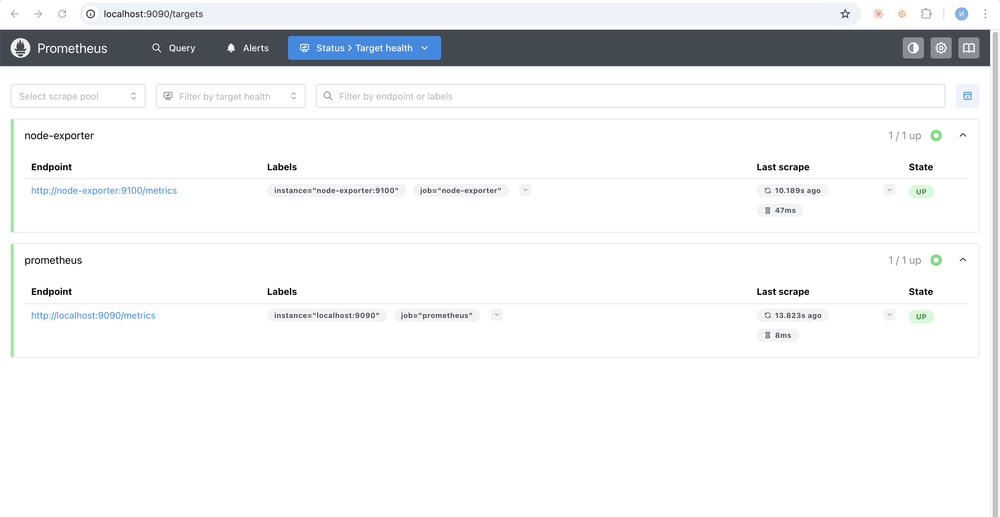
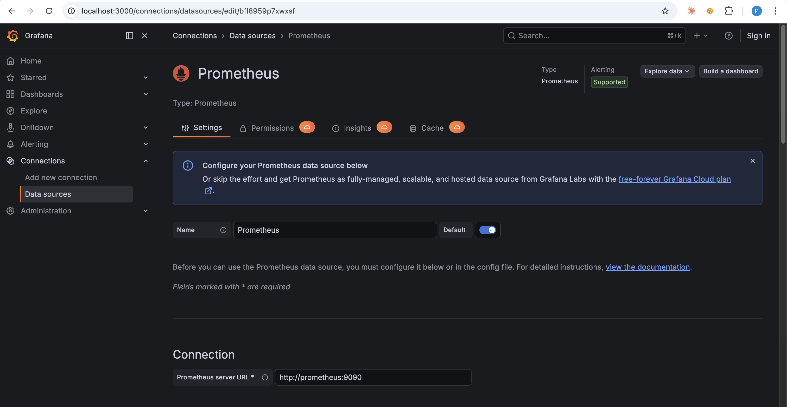
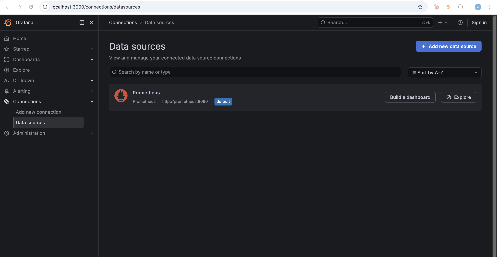
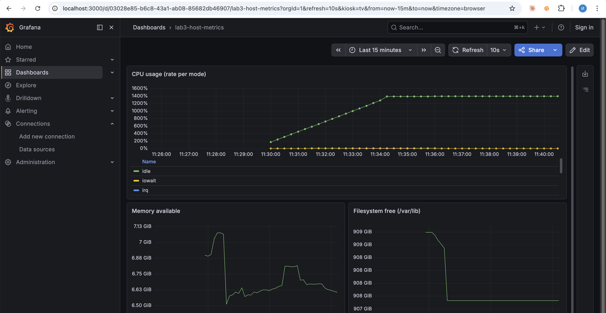
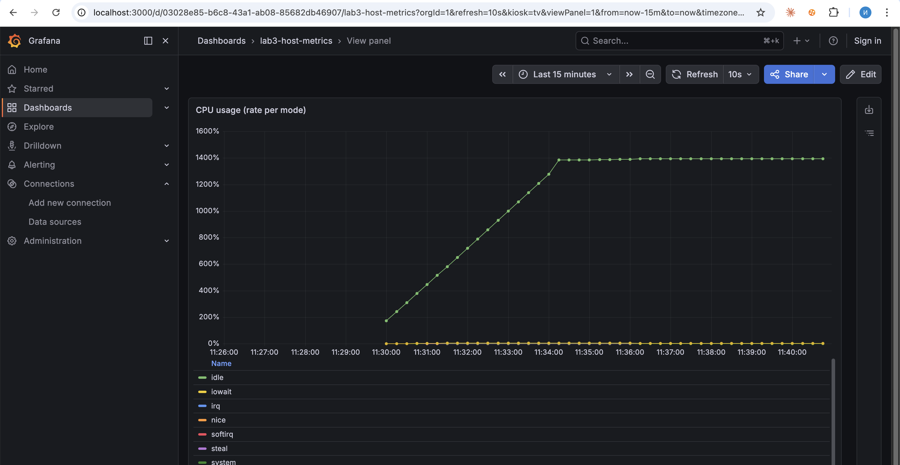
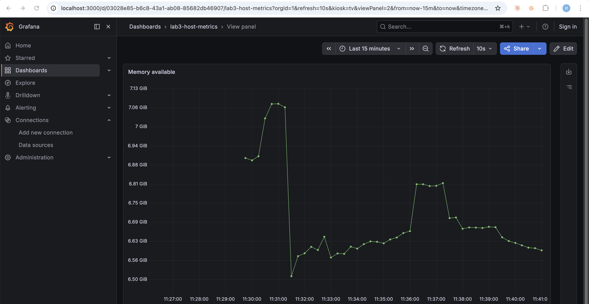

University: [ITMO University](https://itmo.ru/ru/)
Faculty: [FICT](https://fict.itmo.ru)
Course: [Введение в веб технологии](https://itmo-ict-faculty.github.io/introduction-in-web-tech/)
Year: 2025/2026
Group: U4255
Author: Yangalin Islam Azamatovich
Lab: Lab3
Date of create: 06.05.2026
Date of finished: 06.05.2026

---

# Лабораторная работа №3 — Мониторинг с Prometheus и Grafana

## Цель

Развернуть локальный стек мониторинга в Docker: Prometheus собирает метрики с
самого себя и с Node Exporter, Grafana визуализирует их на дашборде. Все три
компонента работают в общей пользовательской сети `monitoring`, чтобы
обращаться друг к другу по DNS-именам контейнеров.

## Стек и порты

| Компонент      | Образ                  | Порт хоста | Назначение                          |
|----------------|------------------------|------------|-------------------------------------|
| Node Exporter  | `prom/node-exporter`   | 9100       | системные метрики хоста             |
| Prometheus     | `prom/prometheus`      | 9090       | сбор и хранение метрик (TSDB)       |
| Grafana        | `grafana/grafana`      | 3000       | визуализация (дашборды, source UI)  |

## Ход работы

### 0. Подготовка: сеть и тома

```bash
docker network create monitoring
docker volume create prometheus-data
docker volume create grafana-data
```

Сеть `monitoring` нужна, чтобы Prometheus мог обращаться к Node Exporter
по имени `node-exporter` (как указано в `prometheus.yml`). Тома —
для персистентности TSDB Prometheus и базы Grafana.

### 1. Конфигурация Prometheus

Файл [`prometheus/prometheus.yml`](prometheus/prometheus.yml):

```yaml
global:
  scrape_interval: 15s

scrape_configs:
  - job_name: 'prometheus'
    static_configs:
      - targets: ['localhost:9090']

  - job_name: 'node-exporter'
    static_configs:
      - targets: ['node-exporter:9100']
```

`scrape_interval: 15s` — Prometheus опрашивает каждый target раз в 15 секунд.
Job `prometheus` — самомониторинг, `node-exporter` — метрики системы.

### 2. Запуск Node Exporter

```bash
docker run -d \
  --name node-exporter \
  --restart=unless-stopped \
  -p 9100:9100 \
  -v "/proc:/host/proc:ro" \
  -v "/sys:/host/sys:ro" \
  -v "/:/rootfs:ro" \
  prom/node-exporter \
  --path.procfs=/host/proc \
  --path.rootfs=/rootfs \
  --path.sysfs=/host/sys \
  --collector.filesystem.mount-points-exclude="^/(sys|proc|dev|host|etc)($$|/)"

docker network connect monitoring node-exporter
```

Контейнер подключается к сети `monitoring` отдельной командой
`docker network connect`, потому что в исходной команде запуска сеть не
указана. Это нужно, чтобы Prometheus резолвил `node-exporter:9100`.

Проверка endpoint метрик:

```bash
$ curl -s http://localhost:9100/metrics | head -20
# HELP go_gc_duration_seconds A summary of the wall-time pause (stop-the-world) duration in garbage collection cycles.
# TYPE go_gc_duration_seconds summary
go_gc_duration_seconds{quantile="0"} 0
go_gc_duration_seconds{quantile="0.25"} 0
go_gc_duration_seconds{quantile="0.5"} 0
go_gc_duration_seconds{quantile="0.75"} 0
go_gc_duration_seconds{quantile="1"} 0
go_gc_duration_seconds_sum 0
go_gc_duration_seconds_count 0
# HELP go_gc_gogc_percent Heap size target percentage configured by the user, otherwise 100. ...
# TYPE go_gc_gogc_percent gauge
go_gc_gogc_percent 100
```

### 3. Запуск Prometheus

Из папки `lab3/` (выше уровня `prometheus/`), чтобы `$(pwd)/prometheus`
указывал на каталог с конфигом:

```bash
docker run -d \
  --name prometheus \
  --network monitoring \
  --restart=unless-stopped \
  -p 9090:9090 \
  -v prometheus-data:/prometheus \
  -v $(pwd)/prometheus:/etc/prometheus \
  prom/prometheus \
  --config.file=/etc/prometheus/prometheus.yml \
  --storage.tsdb.path=/prometheus \
  --web.console.libraries=/etc/prometheus/console_libraries \
  --web.console.templates=/etc/prometheus/consoles \
  --storage.tsdb.retention.time=200h \
  --web.enable-lifecycle
```

Хвост `docker logs prometheus`:

```text
level=INFO source=main.go:1395 msg="Server is ready to receive web requests."
level=INFO source=manager.go:209 msg="Starting rule manager..."
```

Проверка targets через API после первого `scrape_interval`:

```bash
$ curl -s http://localhost:9090/api/v1/targets | jq -r ...
job=node-exporter instance=node-exporter:9100 health=up duration=0.0329s
job=prometheus    instance=localhost:9090     health=up duration=0.0099s
```

Скриншот страницы targets:



### 4. Запуск Grafana

```bash
docker run -d \
  --name grafana \
  --network monitoring \
  --restart=unless-stopped \
  -p 3000:3000 \
  -v grafana-data:/var/lib/grafana \
  -e "GF_SECURITY_ADMIN_PASSWORD=admin" \
  grafana/grafana
```

Health endpoint:

```bash
$ curl -s http://localhost:3000/api/health
{
  "database": "ok",
  "version": "13.0.1",
  "commit": "a100054f"
}
```

Логин в UI: `admin` / `admin`.

### 5. Подключение источника данных Prometheus

Configuration → Connections → Data sources → Add data source → Prometheus.

| Поле          | Значение                  |
|---------------|---------------------------|
| Name          | `Prometheus`              |
| Prometheus URL| `http://prometheus:9090`  |
| Default       | да                        |

Save & Test → ответ:

```json
{
  "details": {"application": "Prometheus", "features": {"rulerApiEnabled": false}},
  "message": "Successfully queried the Prometheus API.",
  "status": "OK"
}
```

Скрин формы редактирования источника (URL по DNS-имени `prometheus`):



И список всех источников:



### 6. Дашборд `lab3-host-metrics`

Dashboards → New → Add visualization. Создал три панели:

| Панель                        | Запрос (PromQL)                                           | Единицы   |
|-------------------------------|-----------------------------------------------------------|-----------|
| CPU usage (rate per mode)     | `sum by(mode) (rate(node_cpu_seconds_total[5m]))`         | percentunit |
| Memory available              | `node_memory_MemAvailable_bytes`                          | bytes     |
| Filesystem free (`/var/lib`)  | `node_filesystem_free_bytes{mountpoint="/var/lib"}`       | bytes     |

`rate(...[5m])` показывает прирост счётчика CPU за последние 5 минут — это
типичный способ построить «использование процессора по режимам» из
монотонного counter-а `node_cpu_seconds_total`. `node_memory_MemAvailable_bytes`
и `node_filesystem_free_bytes` — gauge-метрики, отдают мгновенное значение.

> Замечание про mountpoint: спецификация предлагает `node_cpu_seconds_total`
> и метрики «памяти и диска» без конкретики. На macOS/Docker Desktop корневой
> ФС хоста через node-exporter не экспортируется в чистом виде (`/rootfs`
> исключён фильтром `--collector.filesystem.mount-points-exclude`). Поэтому
> для filesystem-панели использовал реально доступный mountpoint `/var/lib`
> (ext4 внутри VM Docker Desktop) — он отображает свободное место рабочего
> тома Docker, что для учебной задачи показывает ровно тот же сюжет
> «диск заполняется/освобождается».

Общий вид:



Отдельные панели:





### 7. Проверка системы

Все контейнеры запущены, сервисы отвечают:

```bash
$ docker ps --format "table {{.Names}}\t{{.Status}}\t{{.Ports}}"
NAMES           STATUS          PORTS
grafana         Up 5 minutes    0.0.0.0:3000->3000/tcp, [::]:3000->3000/tcp
prometheus      Up 12 minutes   0.0.0.0:9090->9090/tcp, [::]:9090->9090/tcp
node-exporter   Up 13 minutes   0.0.0.0:9100->9100/tcp, [::]:9100->9100/tcp

$ curl -s 'http://localhost:9090/api/v1/query?query=up' | jq -r '...'
up{job="prometheus"} = 1
up{job="node-exporter"} = 1
```

## Лабораторная со звёздочкой — этическое тестирование безопасности

Не выполняется. Тестирование чужого сайта без письменного разрешения
владельца — нарушение этики и потенциально законодательства РФ
(статьи 272, 274 УК РФ). При наличии разрешения от владельца ресурса
готов выполнить отдельным заданием.

## Результаты

- Развёрнут стек Prometheus + Node Exporter + Grafana в общей сети `monitoring`.
- Конфигурация Prometheus описывает два scrape-job'а; оба target в статусе UP.
- В Grafana подключён источник Prometheus по DNS-имени контейнера.
- Создан дашборд `lab3-host-metrics` с тремя панелями (CPU rate по режимам,
  memory available, filesystem free) — все панели рисуют живые данные.

## Выводы

- Prometheus pull-моделью и `scrape_interval=15s` нормально снимает метрики
  без участия приложения — то самое разделение на «приложение отдаёт `/metrics`»
  и «коллектор сам ходит и забирает».
- Общая Docker network — обязательное условие, чтобы один контейнер мог
  обращаться к другому по имени, а не по IP. Без `monitoring` Prometheus не
  смог бы найти `node-exporter:9100`.
- `rate()` поверх counter-метрики — стандартный приём PromQL: counter монотонно
  растёт, а нам нужна скорость роста за окно. `irate()` — то же, но по двум
  последним точкам, более «дёрганый» график; для дашбордов обычно `rate(5m)`.
- Persistence в томах решает: TSDB Prometheus переживает рестарт, дашборды
  и source-конфигурация Grafana — тоже.
